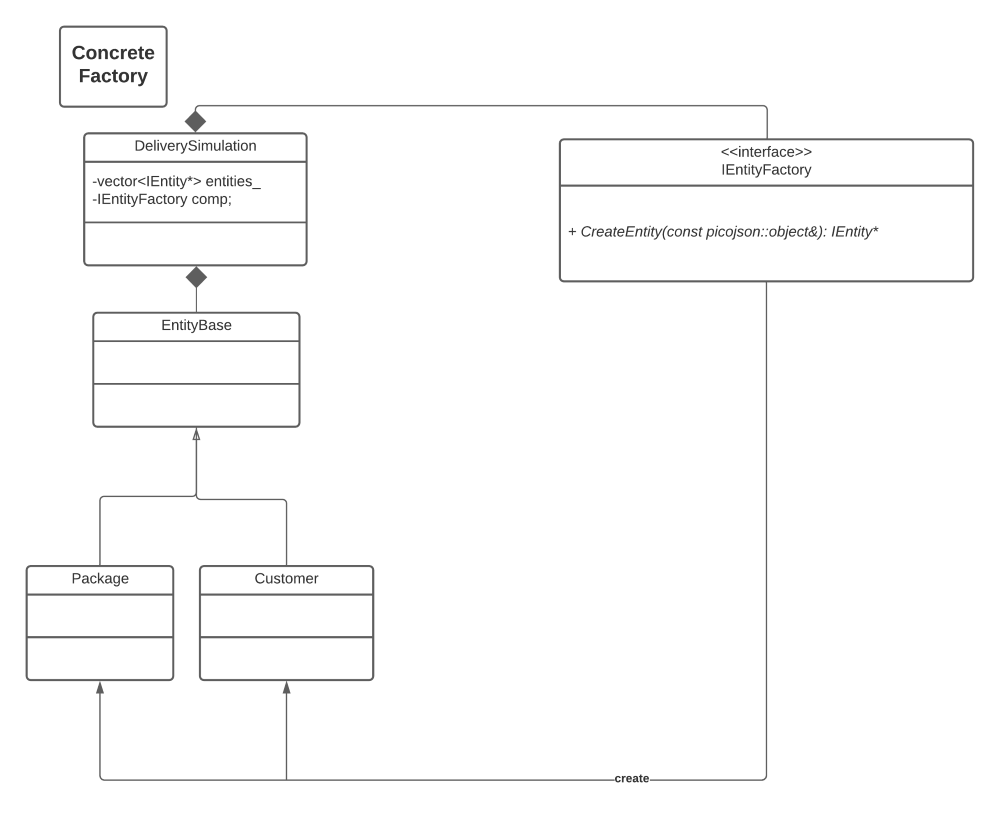

# Package Delivery System

## Authors
* Wiley Bui
* Dustin Zhang
* Aunya Mukherjee
* Lin Huynh

## Overall Project


Figure 1. Concrete Factory Pattern

First, we begin with the concrete factory pattern. As we can see in Figure 1, there is a new class call EntityFactory that is responsible for creating Entity. This prevents the program to have a lot of different Entity derived classes and to not know which one would be created until runtime. This is good; however, there is still tight coupling. Everytime we have a new Entity derived class, we have to add new case/ new if else statement in EntityFactory. Here is how Abstract Factory come to the story.


Figure 2. Abstract Factory Pattern

Figure 2 depicts how the UML of this program would look like if we employ Abstract Factory pattern. EntityFactory becomes an abstract class, pushing the creation of each Entity derived class into subclasses. For example, Drone object is created by DroneFactory. With this model, every time we create a new Entity derived class, we just need to create a new subclass of EntityFactory. However, even with this pattern, the CreateEntity function of DeliverySimulation still contains a thread of if-else statement to decide which Entity to create. This is not idea, since every time we add a new Entity derived class, we still have to edit our CreateEntity function in DeliverySimulation. This is where Composite Factory Pattern helps.


With the Composite Factory pattern, we can just create a CompositeFactory attribute in DeliverSimulation class, then use that to link to the other attribute. This would eliminate the long list of if and else statement anywhere in the code, and allow easy addition of new Entity derived as well as EntityFactory derived classes.

### Discussion about the composite factory pattern implemented in the package delivery system:
So we have discussed about the advantage of Composite Factory Pattern in the previous section. This pattern is excellent; however, it does have some disadvantages. The most obvious cons of composite factory pattern is that it might be difficult to provide a common interface for classes whose functionality differs too much. We might need to overgeneralize the componenent interface, making it harder to comprehend. In addition, the cons from this package delivery simulation, the composite factory pattern requires more classes to be created. It is hard to see the relationship between these classes even with a UML diagram.

### Designing and Implementing Strategy Pattern
In order to implement the strategy pattern in regards to choosing which route strategy for the drone to follow, we had to make several changes to our existing code. First, we had to create the interface which the concrete strategies would override. This abstract interface class is called RouteStrategy and it has the method GetRoute. We also have three concrete strategy classes; SmartRoute, BeelineRoute, and ParabolicRoute. These concrete classes inherit from RouteStrategy, and they implement the GetRoute method to their own specifications. Once we had this structure in place, we had to alter the drone and robot classes to extract the path type information from the json details. Once the constructor was aware of which type of path was specified, it would store a pointer to that class type in it’s routeStrategy attribute. This way, when we are in the delivery simulation, we can call the GetRoute method from the routeStrategy attribute of the carrier. The default route is set to smart path, and for the robots, only smart path is implemented (as robots cannot fly).


Figure 4. Strategy Pattern used to develop Route Strategy, including
BeelineRoute, SmartRoute and ParabolicRoute"

At first it was difficult to understand the strategy pattern for us, but after working through different examples in class and online (https://www.geeksforgeeks.org/strategy-pattern-set-2/), we were able to better apply the strategy pattern to our own code.

### Designing and Implementing Observer Pattern
In this project, observer Pattern is implemented to notify the observers (the WebSceneViewers and the EntityConsoleLogger) about change(s) in subjects (drones, robots, or packages). For the drones and robots, notifications are sent when they become idle or moving. For the packages, notifications are sent when the package is scheduled to be delivered, is en route (picked up), or is delivered.

We are given the implementation of the Observer classes (including the WebSceneViewers and the EntityConsoleLogger classes), and therefore only need to write implementations for ASubject class, as well as its functionaility, and relate it to Drone, Package and Robot class. Following is the UML depecting the relationship of the Observer pattern that we implement.


Figure 4. Observer Pattern used to send notification about drones, robots,
and package to selected observers"

### Designing and Implementing Different Route
Drones and Robots are carriers, where they can deliver from a source to the designated location. When a carrier moves, it notifies to all the observers the path of its current destination. Likewise, when a carrier stops moving, it also notifies all the observers. To go to the destination, there are three different route options that carriers can use, such as the SmartRoute, BeelineRoute, and ParabolicRoute, all of which are handled by RouteStrategy. However, the only strategy for the robots to deliver is the smart route since they cannot fly whereas the drones can use all three strategies since they are able to move in any 3D space (except buildings). The default strategy for the deliveries is the SmartRoute.

The *SmartRoute* uses the A* algorithm to find the shortest path, which uses the IGraph::GetPath() function. This path allows both the robot and the drone to deliver on the specified "roads" without having to worry about colliding into buildings.

For the *BeelineRoute*, the only type of carrier that can use this beeline path is for the drone, where it flies up to a height of 400 from its source location. It then flies horizontally to its destination. Lastly, it flies down to the ground to reach the destination. The beeline route uses the height of 400 so it prevents the drones to not hit any building that crosses its path from one place to another.

For the last strategy, *ParabolicRoute*, only the drones can use the parabolic path where it followed by a smooth projectile curve. The calculation is as follows:

y = (1 - distance(V, Vm)^2 / distance(Vo, Vm)^2) * j (2), where
Vo is our source point
V is the point we are moving to
Vm is our midpoint equal to distance(source, destination) / 2
T is the number of steps we are estimating
Vt is our step interval equal to distance(source, destination) / T
j is a tuning parameter that we can use to avoid building collision and scale the parabola's slope
However for a pure parabolic path, when the package is somewhat in a building, drone clips that building a little bit in the scene when getting the package on its descent.

In order to solve the problem, we first raise the drone to a certain height first,then perform parabolic movement in the air and descend veritcally.

When a drone carrier runs out of battery in mid air, it becomes idle and also notifies the observer. It then falls down to the ground, along with its package if it currently delivers one. Therefore, another carrier, especially a robot, can come over to the dead drone to pick up the undelivered package and deliver it back to its corresponding customer. Similarly, when a robot carrier runs out of battery, it notifies the observer and stays right where it is because it's at the ground, making it easier for other carriers to come & pick up the package.

### Dicussion of new feature: Recharging Drones and Recharging Stations
We chose to implement a system that has designated “recharge_drones” that will wait at a recharge station until they are notified that a delivery carrier has run out of battery. Once they are notified, a recharging mission will be “scheduled,” and the recharge drone can fly to the specified carrier and charge it for a given amount of time, before returning to the recharging station. We made several calculated decisions about how the drone would know how much charge to give, and make sure that it has enough charge to return to the charging station. With this new implementation, we are able to recharge carriers that have died, so that they can resume delivering packages.


A Diagram denoting the relationships between recharging drones, recharging stations and other entities.

We had to write 4 new classes. We needed a class each for the functionalities of the recharging station and the recharging drone, and we needed to write a factory for each of these classes as well, so that they could be created in the composite factory pattern.

In order to implement this, we had to use the factory pattern that we implemented in iteration 1. The true benefits of this pattern were made clear to us when we updated our code to include entities “recharge_stations” and “recharge_drones”. Since we have already done the work of implementing the factory pattern, creating new entities required very little fixing of old code, and we just had to create new factories that were added into the composite factory.

What was most difficult for us was integrating our new features into the pre-existing code. For example, we had some trouble editing the json files to be able to accommodate our new functionality, but after a while we were able to figure it out. Other than small snaffles like these, we were able to implement this feature without much issue, since all of the patterns we used were pre-existing in our code, we just had to change the functionalities.

## Pre-requisites
  * [Git](https://git-scm.com/)

## Docker Pre-requisites
  * Windows 10 Home
    * Install [wsl2 and Ubuntu](https://www.youtube.com/watch?v=ilKQHAFeQR0&list=RDCMUCzLbHrU7U3cUDNQWWAqjceA&start_radio=1&t=7)
  * Install [Docker Desktop](https://hub.docker.com/?overlay=onboarding) from [Docker Hub](https://hub.docker.com/)
  * Linux
    * Use [docker group instead of sudo](https://www.digitalocean.com/community/tutorials/how-to-install-and-use-docker-on-ubuntu-18-04)

## Getting Started with Docker

1. Build docker image

    ```bash
    bin/build-env.sh
    ```

2. Run docker image

    ```bash
    #Usage bin/run-env.sh <port - optional(default 8081)>
    bin/run-env.sh
    ```

3. Build project web server (inside docker image) NOTE: You won't be able to `cd` here yet because the project directory does not exist. If you were able to launch the above commands you should now be inside the docker image. You can exit it with CTRL+D now.

    ```bash
    # Inside docker image
    cd /home/user/repo/project
    make
    ```

4. Run web server (inside docker image)

    ```bash
    # MUST be within project/ directory inside docker image
    cd /home/user/repo/project
    ./bin/run.sh
    ```

5. Open up Firefox and browse to http://127.0.0.1:8081/


## Getting Started using SSH on CSE Lab machines

1. Initial Setup of remote web server (full copy)

    ```bash
    #Example: ./project/bin/setup-server.sh dtorban 05
    ./project/bin/setup-server.sh <username> <computer_number>
    ```

2. Run remote web server (only copies src directory)

    ```bash
    #Example: ./project/bin/server.sh dtorban 05 8081
    ./project/bin/server.sh <username> <computer_number> <port>
    ```


5. Open up Firefox and browse to http://127.0.0.1:8081/

## Getting Started with VOLE-3D or VOLE

1. Log on to [VOLE-3D or VOLE](https://vole.cse.umn.edu/) (VOLE is slower for graphics, but is great for tests, etc...)

2. Build project

    ```bash
    cd /path/to/cloned/repository
    cd project
    make
    ```

 2. Run project

    ```bash
    # MUST be within project/ directory
    ./bin/run.sh
    ```

 5. Open up Firefox and browse to http://127.0.0.1:8081/

